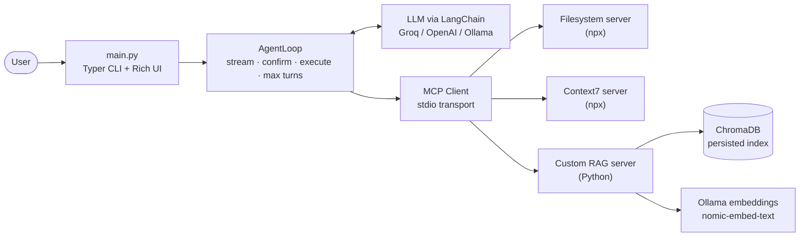

# 🤖 CLI AI Coding Assistant

An autonomous, terminal-based coding assistant that can read and edit your files, look up library documentation, and answer questions from a private RAG index. It runs on a **custom agentic loop** with **MCP (Model Context Protocol)** tool servers, supports **Groq, OpenAI, and Ollama** through a single interface, and asks for your approval before every tool call by default.

`Python 3.11+` `LangChain` `MCP` `ChromaDB` `Ollama` `Groq` `Typer` `Rich`

<!-- TODO: add a terminal GIF or screenshot here (e.g. recorded with asciinema, VHS, or ScreenToGif). A 20-second demo of one task from prompt to completion is the single most effective thing you can add. -->

---

## ✨ Features

- **Custom agentic loop** with per-turn streaming, a hard turn limit, and full control over tool execution (no black-box `AgentExecutor`)
- **Human-in-the-loop safety:** every tool call is shown with its arguments and needs a `y/n` approval, unless you opt in to `--auto`
- **Model-agnostic:** swap between Groq, OpenAI, and local Ollama models with a flag
- **MCP-native tooling:** connects to multiple MCP servers over stdio and adapts their tools into LangChain tools automatically
- **Custom RAG MCP server:** semantically chunked LangChain documentation, embedded locally with Ollama and stored in ChromaDB
- **Rich terminal UI:** live token streaming, color-coded tool call and result panels, spinners, and turn-limit warnings
- **Sandboxed filesystem access:** the agent can only touch the directory you pass with `--workspace`

---

## 🏗️ Architecture



**How a turn works**

1. The system prompt and message history are sent to the model with the available tools bound.
2. The response streams to the terminal token by token.
3. If the model requests no tools, the task is complete. Otherwise each tool call is displayed, optionally confirmed by the user, executed through the MCP client, and its result is appended to the history.
4. The loop repeats until the task finishes or the turn limit is reached.

---

## 🧰 Tech stack

| Layer | Technology |
|---|---|
| Language | Python 3.11+ |
| LLM providers | Groq (`llama-3.3-70b-versatile`, default), OpenAI, Ollama |
| LLM abstraction | LangChain (`langchain-groq`, `langchain-openai`, `langchain-ollama`) |
| Tool protocol | MCP Python SDK (stdio transport) |
| RAG chunking | `SemanticChunker` (`langchain_experimental`) |
| Embeddings | Ollama `nomic-embed-text` (runs locally) |
| Vector store | ChromaDB (persisted to disk) |
| CLI / UI | Typer, Rich |
| Config | python-dotenv |

---

## 📁 Project structure

```
coding-assistant/
├── main.py                  # CLI entry point (Typer)
├── config.py                # Env + typed config loading, pre-flight checks
├── pyproject.toml           # Dependencies and `assistant` console script
├── .env.example             # Template for API keys
│
├── agent/
│   ├── loop.py              # Agentic loop: streaming, confirmation, max turns
│   └── history.py           # Message history with auto-trimming
│
├── providers/
│   └── factory.py           # ChatModel factory (Groq / OpenAI / Ollama)
│
├── mcp_client/
│   ├── client.py            # Connects to all MCP servers, lists tools
│   ├── tool_adapter.py      # MCP tool → LangChain BaseTool
│   └── server_configs.py    # Stdio launch configs for each server
│
├── display/
│   └── console.py           # Rich panels, streaming, spinners, prompts
│
├── mcp_servers/
│   └── rag_server/
│       ├── indexer.py       # One-time: load → semantic chunk → embed → persist
│       ├── retriever.py     # Query ChromaDB, return top-k chunks
│       └── server.py        # MCP server exposing RAG as tools
│
└── tests/                   # Smoke tests for each layer
```

---

## 🚀 Getting started

### Prerequisites

- Python 3.11+
- Node.js and `npx` (required by the filesystem and Context7 MCP servers)
- [Ollama](https://ollama.com) (required for the RAG server's embeddings; also needed if you want to run local models)
- An API key for at least one provider (Groq by default)

### Installation

```bash
# 1. Create and activate a virtual environment
python -m venv venv
source venv/bin/activate        # Windows: venv\Scripts\activate

# 2. Install the project (also installs the `assistant` command)
pip install -e .

# 3. Configure your environment
cp .env.example .env
# Then edit .env and set GROQ_API_KEY (and OPENAI_API_KEY / CONTEXT7_API_KEY if you use them)
```

### Verify your setup

```bash
python -c "from config import config; warnings = config.validate_environment(); print(warnings if warnings else 'All checks passed')"
node --version && npx --version && ollama --version
```

### Build the documentation index (one time)

The RAG server answers questions from indexed LangChain documentation. Build the index once:

```bash
ollama pull nomic-embed-text
python main.py --setup-rag
```

The indexer loads 18 documentation pages, splits them into **115 semantic chunks**, embeds them locally, and persists them to ChromaDB. Later runs skip this step. Use `python -m mcp_servers.rag_server.indexer --force` to rebuild.

---

## 💻 Usage

```bash
# Interactive REPL
python main.py

# Run a single task and exit
python main.py "Summarise config.py"

# Skip confirmation prompts
python main.py --auto "List the files in the current directory"

# Use a different provider or model
python main.py --provider openai --model gpt-4o "Explain config.py"
python main.py --provider ollama --model llama3.2 "List files"

# Limit what the agent can access and how long it can run
python main.py --workspace ./src --max-turns 5 "Refactor the login module"
```

After `pip install -e .` you can use `assistant` in place of `python main.py`.

### Example session

```
> List the files in the current directory

╭─ 🔧 Tool Call ──────────────────────╮
│ list_directory                       │
│ { "path": "." }                      │
╰──────────────────────────────────────╯
Execute this tool? [y/n]: y

╭─ ✅ Tool Result ────────────────────╮
│ agent/  config.py  main.py  ...      │
╰──────────────────────────────────────╯

Assistant  The directory contains: agent/, config.py, main.py, ...
✔  Task complete.
```

### Options

| Option | Description | Default |
|---|---|---|
| `[TASK]` | Task to run immediately; omit for interactive mode | none |
| `--auto` | Execute tools without asking for confirmation | off |
| `--max-turns` | Hard limit on agentic loop iterations (1 to 100) | 20 |
| `--provider` | `groq`, `openai`, or `ollama` | `groq` |
| `--model` | Model name override | provider default |
| `--workspace` | Directory the filesystem server may access | current directory |
| `--setup-rag` | Build (or rebuild) the documentation index and exit | n/a |

### REPL commands

`help` shows the commands, `clear` wipes conversation history, and `exit` (also `quit`, `q`, `:q`, or `Ctrl+C`) shuts down the MCP servers and quits.

---

## 🔌 Available tools

The agent connects to three MCP servers at startup (18 tools in total, 12 exposed to the model after filtering):

| Server | Purpose |
|---|---|
| **Filesystem** (`@modelcontextprotocol/server-filesystem`) | Read, write, edit, search, and list files inside the workspace |
| **Context7** (`@upstash/context7-mcp`) | Look up up-to-date library documentation |
| **RAG** (custom, in this repo) | `search_langchain_docs` retrieves relevant chunks from the local LangChain docs index |

---

## 🧠 Design decisions

- **Custom loop instead of `AgentExecutor`.** Writing the loop directly gives full control over streaming, turn counting, and per-tool confirmation, which a prebuilt executor doesn't expose cleanly.
- **Hard turn limit.** A configurable maximum prevents runaway loops and runaway API costs. The user is warned at 75% of the budget.
- **MCP over stdio for every server.** One consistent transport with no ports to manage, and any MCP server can be added with a single launch config.
- **Semantic chunking over fixed-size chunking.** `SemanticChunker` splits at embedding-similarity breakpoints, producing coherent chunks that retrieve more accurately than arbitrary token windows.
- **Local embeddings.** Ollama's `nomic-embed-text` keeps indexing and retrieval free and offline.
- **Safe by default.** Confirmation is on unless you pass `--auto`, and file access is limited to the workspace.
- **Groq as the primary provider.** Fast inference, a generous free tier, and tool-calling support.

---

## 🛠️ Engineering challenges

| Problem | Root cause | Fix |
|---|---|---|
| `ImportError` on `ClientSession` (circular import) | The local `mcp/` package shadowed the installed `mcp` SDK | Renamed the local package to `mcp_client/` |
| Groq returned "Failed to call a function" | Llama models on Groq fail reliably when given more than roughly 12 to 14 tools | Filtered redundant or low-value tools (18 down to 12) and set `parallel_tool_calls=False` |
| RAG server broke the MCP connection | ChromaDB and Ollama startup output was written to stdout, corrupting the JSON-RPC stream | Imported those libraries at module level so they load before the stdio transport takes over stdout |
| Indexer stopped extracting content | The LangChain docs site migrated from Docusaurus to Mintlify | Replaced the CSS selector with a regex match on the `prose` class |

---

## ✅ Testing

Each layer has a smoke test that exercises it end to end:

```bash
PYTHONUTF8=1 python tests/test_display.py     # Rich display components
PYTHONUTF8=1 python tests/test_providers.py   # Provider factory (makes a live Groq call)
PYTHONUTF8=1 python tests/test_mcp.py         # MCP client + tool adapter against the filesystem server
python tests/test_rag.py                      # Index, retriever, and RAG MCP server
python tests/test_agent.py                    # Agentic loop, history, tool calling, turn limit
```

> `PYTHONUTF8=1` ensures emoji and box-drawing characters render correctly on Windows terminals. Some tests call live APIs and need valid keys.

---

## ⚠️ Known limitations

- Groq's tool-calling limits mean the model sees 12 of the 18 available tools (see the tool filtering described above).
- If a provider API call fails, the REPL prints an error and clears the conversation history.
- Python 3.14 shows a harmless Pydantic V1 deprecation warning from LangChain; it does not affect functionality.

---

## 📬 Contact

Built by **Mitali Yadav** · [LinkedIn](https://www.linkedin.com/in/mitali-yadav/) · [GitHub](https://github.com/mitaliyadav)
